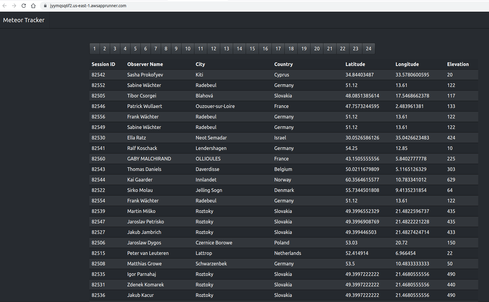

# Alula code test

## Choice of architecture
I chose to use App Runner, as the request was a simple environment.  I could have launched an ec2 within the VPC, but would have needed to script the instance to run the containers, add ELB, etc.  App Runner handles this for me, with the main drawback that it doesn't run in a VPC, which made exposing the DB to the world necessary.  

Normally I would **NEVER** do this, but to keep things simple, I went with this approach.

## Architecture
With this repo we are creating a VPC, with 2 subnets which are attached to an internet gateway and NAT gateway.
We then create an RDS postgresql database which is public facing, as amazon's app runner service doesn't run within a VPC.

We then create a container registry (ECR), since app runner cannot interface with other registries at this time.
Once that's created, we log into the registry with docker, then pull the image from dockerhub, re-tag it and push the image into ECR.

Once the image is in ECR, we can then create the apprunner services.

# How to launch
1. You'll need terraform installed
2. You'll need awscli installed
   1. Create a profile called alula with your aws account's keys
3. You'll need docker installed (to pull and push an image)

*The following instructions are run in a terminal, inside the terraform folder.*

## Initialize terraform
This will install the necessary providers to apply the changes.
```sh
terraform init
```

## run terraform plan
This runs a sanity check on the terraform files, will output what would be changed when applied.
```sh
terraform plan
```

## apply the infra
This will apply the changes and create the infrastructure, run the app.
```sh
terraform apply
```

Output will look similar to this (ran apply wrapped with `time`)
```sh
Apply complete! Resources: 24 added, 0 changed, 0 destroyed.

Outputs:

alula_db_endpoint = "terraform-20210829151517966900000002.cypdsnemzmzl.us-east-1.rds.amazonaws.com:5432"
meteor-tracker-api_service_url = "avqpab82kq.us-east-1.awsapprunner.com"
meteor-tracker_service_url = "jyymqsq6f2.us-east-1.awsapprunner.com"

real	13m9.294s
user	0m11.514s
sys	0m1.772s
```

Site will look like 

## destroy the environment
This will remove the infrastructure.
```sh
terraform destroy
```


